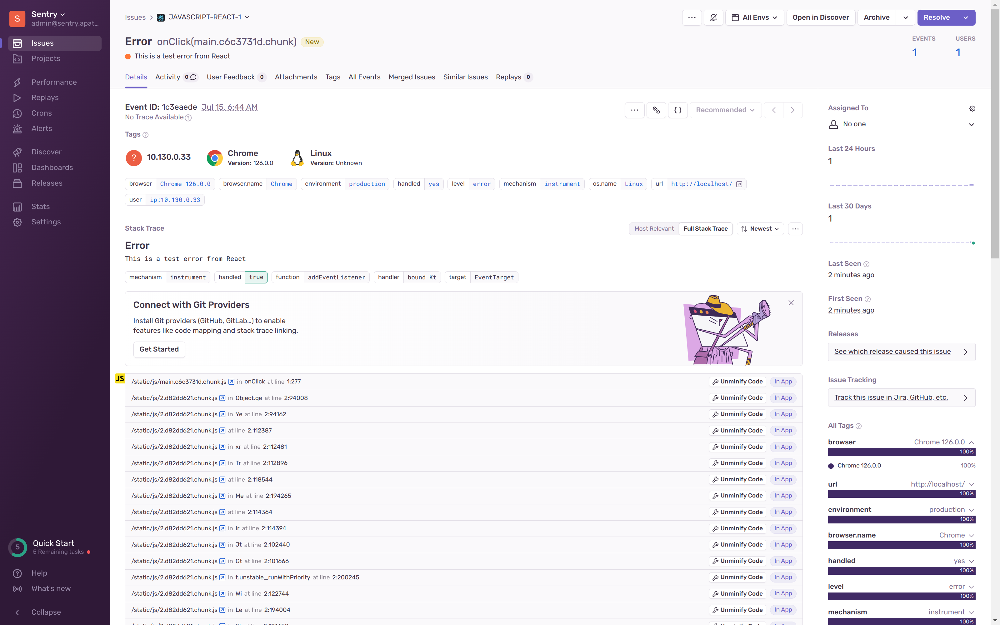

**Как установить sentry в kubernetes, отловить exception на бекенде, в браузере, на android**

В статье рассматривается Sentry — инструмент для сбора exception, который помогает разработчикам быстро обнаруживать и устранять проблемы, сокращая время выхода новых релизов и повышая удовлетворенность пользователей.

Sentry обладает следующими преимуществами:

 - Мониторинг exception на мобильных устройствах и в браузере

 - Открытый исходный код: Разработчики могут бесплатно использовать, модифицировать и расширять [Sentry](https://github.com/getsentry/sentry), благодаря активному сообществу.

 - Широкая поддержка языков и фреймворков: Поддерживает множество языков и фреймворков, делая его универсальным инструментом. 

 - Детальная информация об exception: Предоставляет подробную информацию для быстрой идентификации и исправления проблем.

 - Аналитика и отчеты: Позволяет анализировать статистику exception и создавать детальные отчеты.

 - Самостоятельное развертывание: Возможность развертывания на собственных серверах для контроля над данными.

 - Обширная документация и поддержка сообщества: Помогает быстро начать работу и решать проблемы.

В этом посте будет рассмотрена минимальная установка Sentry в Kubernetes c clickhouse-operator и kafka-operator, так как установка sentry в kubernetes имеет много подводных камней. Используется clickhouse operator, так как sentry не работает с более новыми версиями clickhouse, которые предлагает Яндекс облако.

Для разворачивания Sentry используем Яндекс Облако, Managed Kubernetes, Managed PostgreSQL, Managed Redis, Managed S3.

Настройка HTTPS выходит за рамки данной статьи.

Регистрируем домен на reg.ru. Исправляем домен apatsev.org.ru на ваш домен везде в коде. Версии приложений меняем осторожно, иначе могут быть баги, например https://github.com/ClickHouse/ClickHouse/issues/53749.

В конфигурационных файлах terraform заполняем folder_id, network_id, subnet_id.s

Создаем Kubernetes с помощью модуля https://github.com/terraform-yacloud-modules/terraform-yandex-kubernetes
```shell
cd kubernetes
terraform init
terraform apply
cd ..
```

Создаем PostgreSQL с помощью модуля https://github.com/terraform-yc-modules/terraform-yc-postgresql
```shell
cd postgresql
terraform init
terraform apply
terraform output fqdn_database
terraform output owners_data
cd ..
```

Создаем Redis с помощью модуля https://github.com/terraform-yacloud-modules/terraform-yandex-redis
```shell
cd redis
terraform init
terraform apply
terraform output fqdn_redis
terraform output password
cd ..
```

Создаем S3 с помощью модуля https://github.com/terraform-yacloud-modules/terraform-yandex-storage-bucket
```shell
cd s3
terraform init
terraform apply
terraform output access_key
terraform output secret_key
cd ..
```

Адреса, креды PostgreSQL, Redis, S3 прописываем в файле values-sentry.yaml

Устанавливаем новое подключение к k8s.
```shell
yc managed-kubernetes cluster get-credentials --id xxxx --external
```

Создаем namespace sentry.
```shell
kubectl create namespace sentry
```

Установливаем zookeeper, altinity-clickhouse-operator, strimzi-kafka-operator.
Вместо 3 запусков helm запустим 1 раз [helmwave](https://github.com/helmwave/helmwave).
Helm репозитории и настройки описаны в файле helmwave.yml
```shell
helmwave up --build
```

Ждем когда поды перейдут в состояние Ready, например через [k9s](https://github.com/derailed/k9s)
```
k9s -A
```

Создаем kafka-node-pool, kafka, kafka-topics с помощью https://github.com/strimzi/strimzi-kafka-operator.
Примеры берем отсюда https://github.com/strimzi/strimzi-kafka-operator/tree/main/examples/kafka
```
kubectl apply -f kafka-node-pool.yaml
kubectl apply -f kafka.yaml
kubectl apply -f kafka-topics.yaml
```

Ждем когда поды Kafka перейдут в состояние Ready, например через [k9s](https://github.com/derailed/k9s)
```
k9s -A
```

Создаем Clickhouse. Придумываем пароль и получаем от него sha256 хеш.
```
printf 'sentry-clickhouse-password' | sha256sum
```
Полученный хеш вставляем в поле "sentry/password_sha256_hex" в файле kind-ClickHouseInstallation.yaml

Из примеров https://github.com/Altinity/clickhouse-operator/tree/master/docs/chi-examples делаем конфиг для clickhouse
Затем применяем его
```shell
kubectl apply -f kind-ClickHouseInstallation.yaml
```

Ждем когда pod Clickhouse перейдут в состояние Ready, например через [k9s](https://github.com/derailed/k9s)
```
k9s -A
```

Устанавливаем sentry.
```shell
helm repo add sentry https://sentry-kubernetes.github.io/charts
helm repo update
helm upgrade --install sentry -n sentry sentry/sentry --version 23.1.0 -f values-sentry.yaml
```

Ждем Clickhouse миграции в pod snuba-migrate.
Чтобы увидеть лог миграции snuba-migrate, можно использовать [stern](https://github.com/stern/stern) для просмотра логов в namespace sentry.
```
stern -n sentry -l job-name=sentry-snuba-migrate
```

Ждем завершения PostgreSQL миграции в pod db-init-job.
Чтобы увидеть лог миграции db-init, можно использовать [stern](https://github.com/stern/stern) для просмотра логов в namespace sentry.
```
stern -n sentry -l job-name=sentry-db-init
```

Смотрим логи в namespace sentry на предмет разных ошибок.
```
stern -n sentry .
```

Открываем URL, прописанный в system.url.
Входим в sentry по кредам, которые вы указали в этом коде.
```
user:
  password: "пароль"
  create: true
  email: логин-в-виде-email
```

# Backend. Пример exception на python.
Создаем project, выбираем python. Создаем директорию example-python. Переходим в директорию example-python.
В директории example-python создаем main.py такого содержания.
```shell
import sentry_sdk
sentry_sdk.init(
    dsn="http://xxxx@sentry.apatsev.org.ru/2",
    traces_sample_rate=1.0,
)

try:
    1 / 0
except ZeroDivisionError:
    sentry_sdk.capture_exception()
```

```shell
python3 -m venv venv
source venv/bin/activate
pip install --upgrade sentry-sdk
python3 main.py
```
В Sentry видим следующую картину


# Frontend. Пример exception на React.
Вот пример простого React кода для отправки исключения (exception) в Sentry через браузер, 
а также Dockerfile для контейнеризации этого приложения.


Структура React проекта:
```shell
.
├── Dockerfile
├── package.json
├── public
│    └── index.html
└── src
    ├── App.js
    ├── index.css
    └── index.js
```

App.js:
```
import React from 'react';
import * as Sentry from '@sentry/react';
import { Integrations } from '@sentry/tracing';

// Инициализация Sentry
Sentry.init({
  dsn: 'YOUR_SENTRY_DSN_HERE', // Замените на ваш DSN
  integrations: [new Integrations.BrowserTracing()],
  tracesSampleRate: 1.0,
});

function ErrorButton() {
  function throwError() {
    throw new Error('This is a test error from React');
  }

  return (
    <button onClick={throwError}>
      Throw Error
    </button>
  );
}

function App() {
  return (
    <div className="App">
      <h1>Sentry Example</h1>
      <ErrorButton />
    </div>
  );
}

export default Sentry.withProfiler(App);
```

index.css:
```
/* src/index.css */
body {
  margin: 0;
  font-family: -apple-system, BlinkMacSystemFont, 'Segoe UI', 'Roboto', 'Oxygen',
    'Ubuntu', 'Cantarell', 'Fira Sans', 'Droid Sans', 'Helvetica Neue',
    sans-serif;
  -webkit-font-smoothing: antialiased;
  -moz-osx-font-smoothing: grayscale;
}

code {
  font-family: source-code-pro, Menlo, Monaco, Consolas, 'Courier New',
    monospace;
}
```

index.js:
```
// src/index.js
import React from 'react';
import ReactDOM from 'react-dom';
// Удалите следующую строку, если не используете index.css
// import './index.css';
import App from './App';

ReactDOM.render(
  <React.StrictMode>
    <App />
  </React.StrictMode>,
  document.getElementById('root')
);
```

Dockerfile:
```
# Используем базовый образ Node.js
FROM node:14

# Устанавливаем рабочую директорию
WORKDIR /app

# Копируем package.json и package-lock.json
COPY package*.json ./

# Устанавливаем зависимости
RUN npm install

# Копируем исходный код
COPY . .

# Собираем React приложение
RUN npm run build

# Используем nginx для раздачи статики
FROM nginx:alpine
COPY --from=0 /app/build /usr/share/nginx/html
EXPOSE 80
CMD ["nginx", "-g", "daemon off;"]
```


Убедитесь, что ваш package.json содержит необходимые зависимости и скрипты для сборки и запуска приложения:
package.json:
```
{
  "name": "sentry-react-example",
  "version": "1.0.0",
  "description": "Example of sending exceptions to Sentry from React",
  "scripts": {
    "start": "react-scripts start",
    "build": "react-scripts build",
    "test": "react-scripts test",
    "eject": "react-scripts eject"
  },
  "dependencies": {
    "@sentry/react": "^6.13.3",
    "@sentry/tracing": "^6.13.3",
    "react": "^17.0.2",
    "react-dom": "^17.0.2",
    "react-scripts": "4.0.3"
  },
  "browserslist": {
    "production": [
      ">0.2%",
      "not dead",
      "not op_mini all"
    ],
    "development": [
      "last 1 chrome version",
      "last 1 firefox version",
      "last 1 safari version"
    ]
  }
}
```


Сборка и запуск Docker контейнера
Соберите Docker образ:
```shell
docker build -t sentry-example .
```
Запустите контейнер:
```shell
docker run -p 80:80 sentry-example
```

Не забудьте заменить YOUR_SENTRY_DSN_HERE на ваш реальный DSN, который вы можете найти в настройках вашего проекта в Sentry.

В браузере открываем http://localhost

Нажимаем на Throw error 


В Sentry видим exception


# Mobile. Пример exception на android.
Пробуем запустить
https://github.com/sentry-demos/android

В случае ошибок ответы можно найти в Readme репозитория.

Склонируйте репозиторий
```shell
git clone git@github.com:sentry-demos/android.git
```
Синхронизируйте проект с файлами Gradle.
```
Tools -> Android -> Sync Project with Gradle Files

In some Android Studio version this will be available under:

File -> Sync Project with Gradle Files
```
Идем в http://sentry.apatsev.org.ru/settings/sentry/auth-tokens/.
Создаем новый token с названием sentry-demos-android:
Идем в Settings -> Auth Token -> Create New token


В корне домашней директории пользователя, кто запускает команду sentry-cli, создаем файл .sentryclirc с содержимым:
```
[auth]
token=auth-token-sentry-demos-android
```

В качестве эмулятор android используем Nexus 5x API 29 x86, Pixel 2 API 29. 

Создаем Android проект с названием android (по умолчанию).

На вкладке manual копируем io.sentry.dsn.

Меняем значение ключа io.sentry.dsn в файл app/src/main/AndroidManifest.xml
```
        <meta-data
            android:name="io.sentry.dsn"
            android:value="http://166c996d93bc76f7706c1cf30fcd91af@sentry.apatsev.org.ru/2" />
```

Поместите проект и организацию в файл Makefile.
```
SENTRY_ORG=sentry # Поменяйте на вашу организацию.
SENTRY_PROJECT=android # Поменяйте на ваш проект.
```

В sentry.properties поменяйте организацию на sentry и пропишите Auth Token
```
defaults.org=sentry
auth.token=auth-token-sentry-demos-android
```

Добавьте следующий код в тег `<application>` вашего AndroidManifest.xml:
```
<application
...
android:usesCleartextTraffic="true"
...
</application>
```
Это позволит избежать ошибки `java.io.IOException: Cleartext HTTP traffic to sentry.apatsev.org.ru not permitted`, которая указывает на то, 
что приложение пытается отправить данные на сервер Sentry по незашифрованному HTTP-протоколу, что запрещено.

Устанавливаем утилиту https://github.com/getsentry/sentry-cli

```

Запустите сборку
```shell
make all
```

Запускаем эмулятор. Нажимаем run app в Android Studio. В самом приложении нажимаем на 3 вертикальные точки.
Затем нажимаем на List App и нажимаем на разные кнопки получая разные Exception.s


Telegram чат по Sentry https://t.me/sentry_ru
